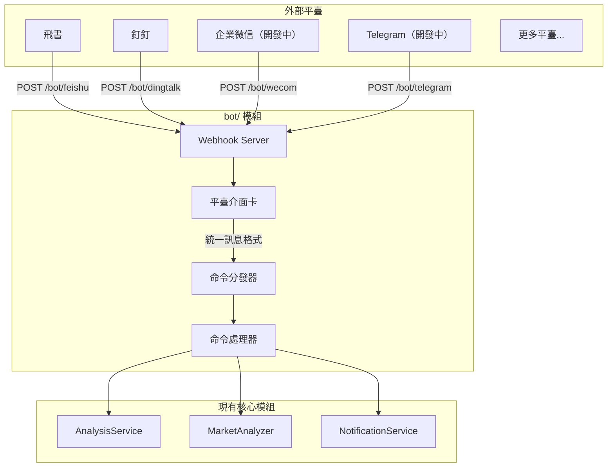

## 一、整體設計




## 二、目錄結構

在專案根目錄新建 `bot/` 目錄：

```
bot/
├── __init__.py             # 模組入口，匯出主要類
├── models.py               # 統一的訊息/響應模型
├── dispatcher.py           # 命令分發器（核心）
├── commands/               # 命令處理器
│   ├── __init__.py
│   ├── base.py             # 命令抽象基類
│   ├── analyze.py          # /analyze 股票分析
│   ├── market.py           # /market 大盤覆盤
│   ├── help.py             # /help 幫助資訊
│   └── status.py           # /status 系統狀態
└── platforms/              # 平臺介面卡
    ├── __init__.py
    ├── base.py             # 平臺抽象基類
    ├── feishu.py           # 飛書機器人
    ├── dingtalk.py         # 釘釘機器人
    ├── dingtalk_stream.py  # 釘釘機器人Stream
    ├── wecom.py            # 企業微信機器人 （開發中）
    └── telegram.py         # Telegram 機器人 （開發中）
```

## 三、核心抽象設計

### 3.1 統一訊息模型 (`bot/models.py`)

```python
@dataclass
class BotMessage:
    """統一的機器人訊息模型"""
    platform: str           # 平臺標識: feishu/dingtalk/wecom/telegram
    user_id: str            # 傳送者 ID
    user_name: str          # 傳送者名稱
    chat_id: str            # 會話 ID（群聊或私聊）
    chat_type: str          # 會話型別: group/private
    content: str            # 訊息文字內容
    raw_data: Dict          # 原始請求資料（平臺特定）
    timestamp: datetime     # 訊息時間
    mentioned: bool = False # 是否@了機器人

@dataclass
class BotResponse:
    """統一的機器人響應模型"""
    text: str               # 回覆文字
    markdown: bool = False  # 是否為 Markdown
    at_user: bool = True    # 是否@傳送者
```

### 3.2 平臺介面卡基類 (`bot/platforms/base.py`)

```python
class BotPlatform(ABC):
    """平臺介面卡抽象基類"""
    
    @property
    @abstractmethod
    def platform_name(self) -> str:
        """平臺標識名稱"""
        pass
    
    @abstractmethod
    def verify_request(self, headers: Dict, body: bytes) -> bool:
        """驗證請求籤名（安全校驗）"""
        pass
    
    @abstractmethod
    def parse_message(self, data: Dict) -> Optional[BotMessage]:
        """解析平臺訊息為統一格式"""
        pass
    
    @abstractmethod
    def format_response(self, response: BotResponse) -> Dict:
        """將統一響應轉換為平臺格式"""
        pass
```

### 3.3 命令基類 (`bot/commands/base.py`)

```python
class BotCommand(ABC):
    """命令處理器抽象基類"""
    
    @property
    @abstractmethod
    def name(self) -> str:
        """命令名稱 (如 'analyze')"""
        pass
    
    @property
    @abstractmethod
    def aliases(self) -> List[str]:
        """命令別名 (如 ['a', '分析'])"""
        pass
    
    @property
    @abstractmethod
    def description(self) -> str:
        """命令描述"""
        pass
    
    @property
    @abstractmethod
    def usage(self) -> str:
        """使用說明"""
        pass
    
    @abstractmethod
    async def execute(self, message: BotMessage, args: List[str]) -> BotResponse:
        """執行命令"""
        pass
```

### 3.4 命令分發器 (`bot/dispatcher.py`)

```python
class CommandDispatcher:
    """命令分發器 - 單例模式"""
    
    def __init__(self):
        self._commands: Dict[str, BotCommand] = {}
        self._aliases: Dict[str, str] = {}
    
    def register(self, command: BotCommand) -> None:
        """註冊命令"""
        self._commands[command.name] = command
        for alias in command.aliases:
            self._aliases[alias] = command.name
    
    def dispatch(self, message: BotMessage) -> BotResponse:
        """分發訊息到對應命令"""
        # 1. 解析命令和引數
        # 2. 查詢命令處理器
        # 3. 執行並返回響應
```

## 四、已支援的命令

| 命令 | 別名 | 說明 | 示例 |

|------|------|------|------|

| /analyze | /a, 分析 | 分析指定股票 | `/analyze 600519` |

| /market | /m, 大盤 | 大盤覆盤 | `/market` |

| /batch | /b, 批次 | 批次分析自選股 | `/batch` |

| /help | /h, 幫助 | 顯示幫助資訊 | `/help` |

| /status | /s, 狀態 | 系統狀態 | `/status` |

## 五、Webhook 路由

在 [api/v1/router.py](../api/v1/router.py) 中註冊路由：

```python
# Webhook 路由
/bot/feishu      # POST - 飛書事件回撥
/bot/dingtalk    # POST - 釘釘事件回撥
/bot/wecom       # POST - 企業微信事件回撥 （開發中）
/bot/telegram    # POST - Telegram 更新回撥 （開發中）
```

## 配置

在 [config.py](../config.py) 中新增機器人配置：

```python
# === 機器人配置 ===
bot_enabled: bool = False              # 是否啟用機器人
bot_command_prefix: str = "/"          # 命令字首

# 飛書機器人（事件訂閱）
feishu_app_id: str                     # 已有
feishu_app_secret: str                 # 已有
feishu_verification_token: str         # 新增：事件校驗 Token
feishu_encrypt_key: str                # 新增：加密金鑰

# 釘釘機器人（應用）
dingtalk_app_key: str                  # 新增
dingtalk_app_secret: str               # 新增

# 企業微信機器人（開發中）
wecom_token: str                       # 新增：回撥 Token
wecom_encoding_aes_key: str            # 新增：EncodingAESKey

# Telegram 機器人（開發中）
telegram_bot_token: str                # 已有
telegram_webhook_secret: str           # 新增：Webhook 金鑰
```

## 擴充套件說明
### 怎樣新增一個通知平臺

1. 在 `bot/platforms/` 建立新檔案
2. 繼承 `BotPlatform` 基類
3. 實現 `verify_request`, `parse_message`, `format_response`
4. 在路由中註冊 Webhook 端點

### 怎樣新增新增命令

1. 在 `bot/commands/` 建立新檔案
2. 繼承 `BotCommand` 基類
3. 實現 `execute` 方法
4. 在分發器中註冊命令

## 安全相關配置

- 支援命令頻率限制（防刷）
- 敏感操作（如批次分析）可設定許可權白名單

在 [config.py](../config.py) 中新增機器人安全配置：

```python
    bot_rate_limit_requests: int = 10     # 頻率限制：視窗內最大請求數
    bot_rate_limit_window: int = 60       # 頻率限制：視窗時間（秒）
    bot_admin_users: List[str] = field(default_factory=list)  # 管理員使用者 ID 列表，限制敏感操作
```

